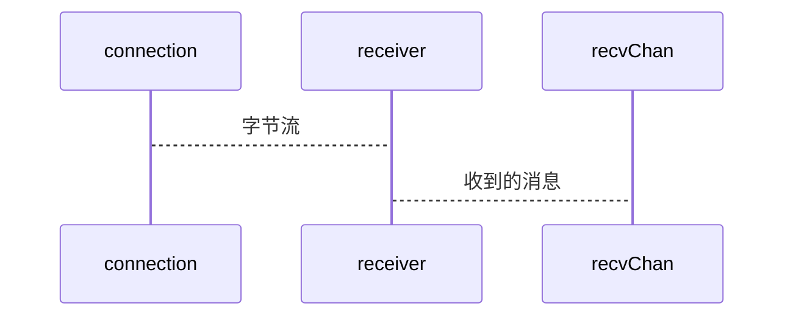
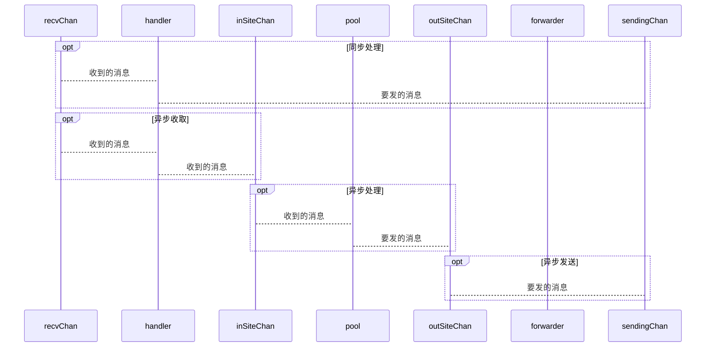
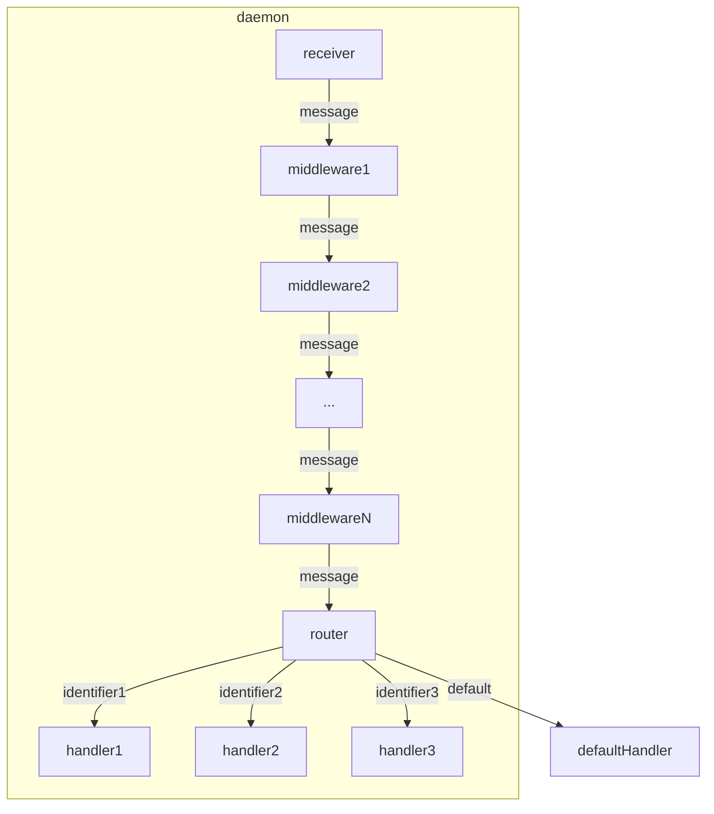
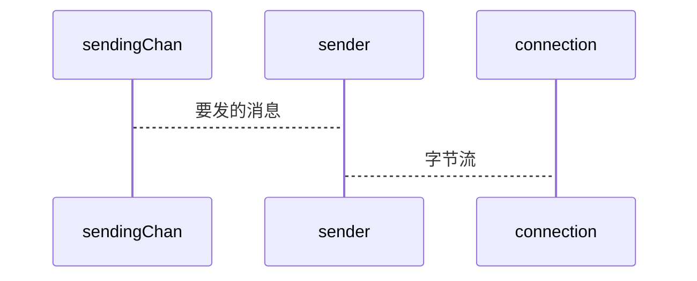

# go-tcp

一个简单的 TCP 服务框架。

## 1. 简介

启动针对一个地址（如`0.0.0.0:8080`）的监听后，对于任何一个连接，都会创建独立的处理流程。

- 建立连接时回调一个函数，获取发送消息的 channel，会持续从该 channel 获取消息并发送出去。
- 对于收到的字节流的处理流程：
  - 收到的字节流，按照预定规则分包。
  - 对每一个分包消息，用中间件进行处理。
  - 对于经过所有中间件之后的消息，按照预设的规则进行处理。
  - 对于没有匹配任何预设规则的消息，使用默认函数处理。

## 2. 监听、接受、维护连接

- 服务启动时，启动一个`Listener`协程负责监听端口。
- 当`Listener`收到新连接时，为新连接启动一个连接专属的`Daemon`协程。
- `Daemon`处理这个了连接的所有消息收发和生命周期管理，直到主动或被动关闭连接并退出协程。

## 3. 消息收取



### 3.1. 分包

分包指的是将 TCP 字节流分解成一段一段的`[]byte`。

在服务启动前，外部可以将分包规则`Splitter`作为回调函数传入服务。连接建立后，`Receiver`会调用这个分包规则来将消息分包。

### 3.2. 解包

解包是将`[]byte`转换成业务相关的`struct`。这一点一般通过预先注册中间件实现。中间件将`[]byte`格式的`Serializable`解析成`struct`再写回去。

## 4. 消息处理

对消息的处理有两种模式，「同步处理模式」和「异步处理模式」。



### 4.1. 同步处理模式

同步处理模式确保一个连接收到的消息会按照顺序被处理，处理完成上一条消息之前，下一条消息不会被处理（前提是上一条消息没有新开协程去处理）。

同步处理模式下，一个消息先要依次经过零个或多个「中间件」，如果仍需处理，再经过「路由处理器」的路由判定。没有命中任何路由处理规则的消息，会被默认处理器处理。

默认处理器`defaultHandler`在服务开始前由外部传入。



#### 4.1.1. 预设中间件

中间件模式有三种用途。

- 改写收到的消息。例如，将普通的字节数组进行解析，转换成结构化的消息。如果解析失败，也可以直接由中间件发送报错的响应消息。
- 过滤要屏蔽的消息。
- 处理连接相关的（非业务的）消息。例如收到了一个握手消息，则中间件可以直接发送响应。

#### 4.1.2. 预设路由处理器

在服务开始前，外部可以注册零对或多对「识别器+处理器」对。

到达预设路由处理器的待处理消息，会经过一系列预设识别器的检查。当满足任何一个识别器的条件，该消息将会被对应的处理器所处理。

#### 4.1.3. 外部函数模式

如果一个到达预设路由处理器的消息没有被任何识别器捕获，则会被默认处理器所处理。

默认处理器在服务开始前可以从外部传入，作为回调函数。

### 4.2. 异步处理模式

异步处理模式来自「同步处理模式」的「外部函数模式」。外部处理器将消息简单地记录在外部的一个队列（channel）里，等待外部其他协程处理，就是异步处理模式。

这意味着如果要发送响应消息（或者其他服务器主动发送到连接的消息），需要有一个异步发送消息的渠道。

异步处理函数要发送响应时，原连接可能已经丢失而无法发送。

每一条消息都附带唯一描述该连接的`ConnectionUUID`。在异步处理时，可以由此找到发送响应消息的连接（或发现连接已经失效）。

## 5. 消息发送



Daemon 里有一个「待发送消息队列」。由发送者协程持续从该队列收取消息，序列化后通过 TCP 连接发送出去。

消息同步处理模式里，如果要发送消息，消息会直接丢进这个「待发送消息队列」。

消息异步处理模式里，要发送的消息需要放在外部的某个「出站消息队列」。该队列在服务启动前通过`OnConnected`回调函数传入服务。具体过程是：

- 服务启动前，外部注册一个`OnConnected`函数到服务内部。
- 服务启动后，每次收到一个连接（创建一个 Daemon）都会回调`OnConnected`。此时，外部需要将该连接专用的「出站消息队列」作为回调函数的返回值传入服务。
- Daemon 里的 Forwarder 协程持续从该外部的「出站消息队列」获取消息，转送到内部的「待发送消息队列」。

## 6. 其他

### 6.1. ConnectionUUID

当连接建立时，服务会为该连接创建一个`UUID`。这个`UUID`会随着该连接收到的所有消息对象传递，于是外部中间件、注册处理器、默认处理器可以知道消息来自哪个连接。

在连接建立，服务回调`OnConnected`时，参数会带有这个`UUID`。于是外部可以为这个连接单独分配一个「出站消息队列」。

## 7. 使用方法

最简单的使用方法：

```go
package main

import "github.com/seedjyh/go-tcp/pkg/tcp"

func main() {
  s := tcp.NewServer()
  // s.SetSplitter( customSplitterFunc )
  // s.SetOnConnected( customOnConnected )
  // s.Use( customMiddlewareFunc )
  // s.SetDefaultHandler( customDefaultHandler )
  // s.Add( customIdentifer, customHandlerFunc )
  go s.Start("0.0.0.0:8080")
  // running...
  s.Stop()
}
```

注意：

- 中间件的调用顺序是按照 Use 的注册顺序。同一个 Use 里多个中间件，则从左到右调用进行。
- 路由规则的调用顺序是按照 Add 的注册顺序。当一个路由规则匹配时，直接调用对应处理函数，而不会调用其他路由规则，也不会调用默认处理函数。
