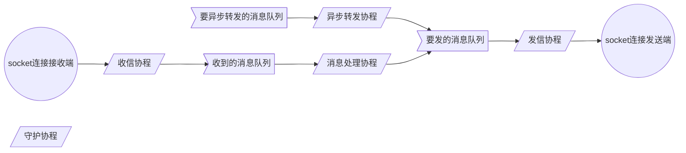
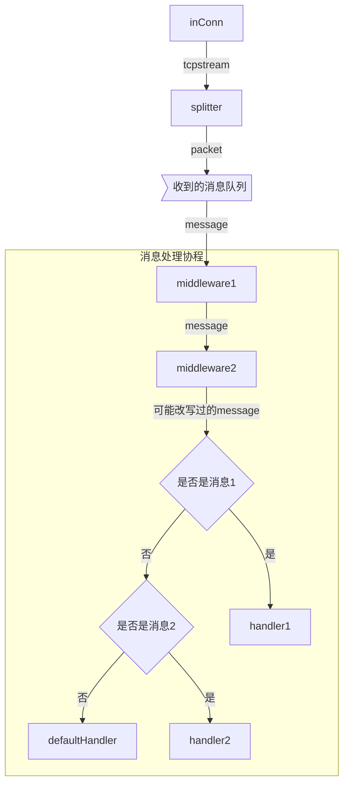
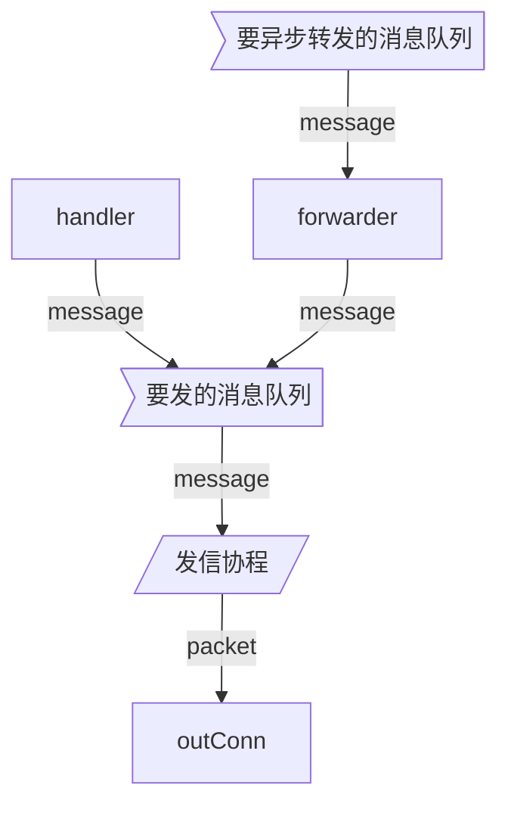

# go-tcp
1
一个简单的TCP服务框架。

## 简介

启动针对一个地址（如`0.0.0.0:8080`）的监听后，对于任何一个连接，都会创建独立的处理流程。

- 建立连接时回调一个函数，获取发送消息的channel，会持续从该channel获取消息并发送出去。
- 对于收到的字节流的处理流程：
    - 收到的字节流，按照预定规则分包。
    - 对每一个分包消息，用中间件进行处理。
    - 对于经过所有中间件之后的消息，按照预设的规则进行处理。
    - 对于没有匹配任何预设规则的消息，使用默认函数处理。

## 并发模式



- socket连接的接收端和发送端在代码中是同一个socket对象。
- 每个连接有5个协程。其中最早创建的是守护协程，由守护协程创建其他协程。需要关闭连接时，守护协程会等所有其创建的协程都退出后才会退出。
- 一共涉及3个消息队列（channel）。其中要异步转发的消息队列从外部传入，另外两个消息队列由守护协程创建。守护协程会在所有其他协程退出后再关闭这两个队列。

## 消息流

### 收到的消息的流向



每个middleware都可能吞掉消息并直接结束。也可能重写消息。

### 发送的消息的流向



## 使用方法

最简单的使用方法：

```go
package main

import "github.com/seedjyh/go-tcp/pkg/tcp"

func main() {
  s := tcp.NewServer()
  go s.Start("0.0.0.0:8080")
  // s.SetSplitter( customSplitterFunc )
  // s.SetOnConnected( customOnConnected )
  // s.Use( customMiddlewareFunc )
  // s.SetDefaultHandler( customDefaultHandler )
  // s.Add( customIdentifer, customHandlerFunc )
  s.Stop()
}
```

注意：

- 中间件的调用顺序是按照Use的注册顺序。同一个Use里多个中间件，则从左到右调用进行。
- 路由规则的调用顺序是按照Add的注册顺序。当一个路由规则匹配时，直接调用对应处理函数，而不会调用其他路由规则，也不会调用默认处理函数。

